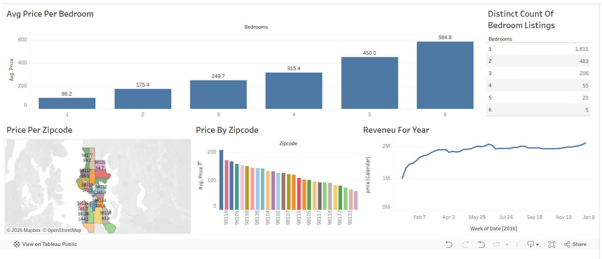

# Airbnb Analysis Dashboard

## Dashboard Preview

## Tableau Public Dashboard

https://public.tableau.com/app/profile/faizan.ahmad.ansari/viz/AirBnbFullProject_17833219880890/Dashboard1

## Project Overview

This Tableau dashboard analyzes Airbnb listing data to identify pricing patterns, revenue trends, and geographic distribution of properties.

## Tools Used

- Tableau Public
- Microsoft Excel

## Dashboard Features

- Average price analysis by bedroom count
- Revenue trend analysis
- Geographic visualization using maps
- Price comparison by zip code
- Interactive data exploration

## Key Insights

- Property prices increase as the number of bedrooms increases.
- Certain zip codes have significantly higher average listing prices.
- Revenue trends highlight changes over time.
- Geographic analysis helps identify high-value locations.
